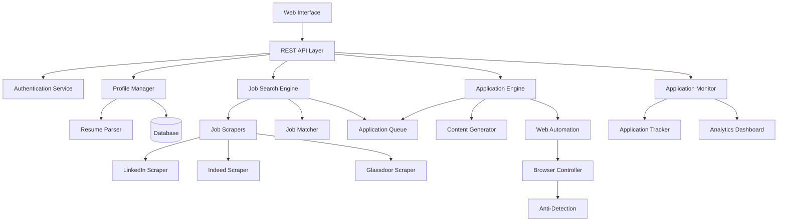

# Design Document

## Overview

The Job Application Agent is a multi-component system that automates the job application process across various job platforms. The system consists of a resume parser, job scraper, matching engine, application generator, and web automation components working together to provide an end-to-end automated job application experience.

The architecture follows a modular design with clear separation of concerns, allowing for easy maintenance and extension to support additional job platforms.

## Architecture



## Components and Interfaces

### 1. Resume Parser Component

**Purpose:** Extract and structure information from uploaded resumes

**Interfaces:**
- `parseResume(file: File) -> UserProfile`
- `extractSkills(text: string) -> string[]`
- `extractExperience(text: string) -> Experience[]`
- `extractEducation(text: string) -> Education[]`

**Key Features:**
- Support for PDF, DOCX, and TXT formats
- OCR capability for scanned documents
- NLP-based information extraction
- Confidence scoring for extracted data

### 2. Job Search Engine

**Purpose:** Discover and evaluate job opportunities across multiple platforms

**Interfaces:**
- `searchJobs(criteria: SearchCriteria) -> JobPosting[]`
- `evaluateMatch(job: JobPosting, profile: UserProfile) -> MatchScore`
- `addToQueue(job: JobPosting, priority: number) -> void`

**Key Features:**
- Multi-platform job scraping
- Intelligent job matching algorithm
- Duplicate detection and filtering
- Priority-based application queuing

### 3. Application Engine

**Purpose:** Generate customized applications and submit them automatically

**Interfaces:**
- `generateCoverLetter(job: JobPosting, profile: UserProfile) -> string`
- `customizeResume(job: JobPosting, profile: UserProfile) -> Document`
- `submitApplication(job: JobPosting, materials: ApplicationMaterials) -> ApplicationResult`

**Key Features:**
- AI-powered content generation
- Dynamic resume formatting
- Form field intelligence
- Multi-step application handling

### 4. Web Automation Component

**Purpose:** Handle browser automation and anti-detection measures

**Interfaces:**
- `navigateToJob(url: string) -> void`
- `fillApplicationForm(fields: FormField[]) -> void`
- `handleCaptcha() -> boolean`
- `submitForm() -> SubmissionResult`

**Key Features:**
- Headless browser control
- Human-like interaction patterns
- CAPTCHA handling
- Rate limiting and delays

### 5. Application Monitor

**Purpose:** Track application status and provide analytics

**Interfaces:**
- `trackApplication(application: Application) -> void`
- `updateStatus(applicationId: string, status: ApplicationStatus) -> void`
- `generateReport(timeframe: DateRange) -> ApplicationReport`

**Key Features:**
- Real-time status tracking
- Success rate analytics
- Error logging and reporting
- Performance metrics

## Data Models

### UserProfile
```typescript
interface UserProfile {
  id: string;
  personalInfo: {
    name: string;
    email: string;
    phone: string;
    location: string;
  };
  skills: string[];
  experience: Experience[];
  education: Education[];
  preferences: JobPreferences;
  resumeVersions: ResumeVersion[];
}
```

### JobPosting
```typescript
interface JobPosting {
  id: string;
  title: string;
  company: string;
  location: string;
  description: string;
  requirements: string[];
  salary?: SalaryRange;
  platform: JobPlatform;
  url: string;
  postedDate: Date;
  matchScore?: number;
}
```

### Application
```typescript
interface Application {
  id: string;
  jobId: string;
  userId: string;
  status: ApplicationStatus;
  submittedAt: Date;
  materials: {
    resume: Document;
    coverLetter: string;
    customFields: Record<string, any>;
  };
  result?: ApplicationResult;
}
```

### JobPreferences
```typescript
interface JobPreferences {
  jobTitles: string[];
  industries: string[];
  locations: string[];
  salaryRange: SalaryRange;
  employmentTypes: EmploymentType[];
  excludedCompanies: string[];
  maxApplicationsPerDay: number;
}
```

## Error Handling

### Error Categories

1. **Parsing Errors**
   - Invalid resume format
   - Corrupted file uploads
   - OCR failures

2. **Scraping Errors**
   - Website access blocked
   - Rate limiting exceeded
   - Page structure changes

3. **Application Errors**
   - Form submission failures
   - Authentication issues
   - CAPTCHA challenges

4. **System Errors**
   - Database connectivity
   - External API failures
   - Resource exhaustion

### Error Handling Strategy

- **Graceful Degradation:** Continue processing other applications when individual failures occur
- **Retry Logic:** Implement exponential backoff for transient failures
- **Circuit Breaker:** Temporarily disable problematic job platforms
- **Fallback Mechanisms:** Use alternative scraping methods when primary approaches fail
- **User Notification:** Alert users of critical failures requiring intervention

## Testing Strategy

### Unit Testing
- Resume parsing accuracy tests
- Job matching algorithm validation
- Content generation quality tests
- Form field mapping verification

### Integration Testing
- End-to-end application flow testing
- Multi-platform scraping validation
- Database transaction integrity
- API endpoint functionality

### Performance Testing
- Concurrent application processing
- Large resume file handling
- High-volume job scraping
- Database query optimization

### Security Testing
- Credential encryption validation
- Input sanitization testing
- Authentication bypass attempts
- Data privacy compliance

### Browser Automation Testing
- Cross-browser compatibility
- Anti-detection effectiveness
- Form submission reliability
- Error recovery mechanisms

## Security Considerations

### Data Protection
- Encrypt all stored credentials using AES-256
- Hash sensitive user data
- Implement secure session management
- Regular security audits

### Compliance
- GDPR compliance for EU users
- CCPA compliance for California users
- Respect robots.txt and terms of service
- Implement data retention policies

### Access Control
- Role-based access control
- API rate limiting
- Secure authentication flows
- Audit logging for all actions

## Scalability Design

### Horizontal Scaling
- Microservices architecture
- Load balancer for API endpoints
- Distributed job queue processing
- Database sharding strategies

### Performance Optimization
- Caching frequently accessed data
- Asynchronous processing for long-running tasks
- Connection pooling for database access
- CDN for static assets

### Monitoring and Observability
- Application performance monitoring
- Real-time error tracking
- Resource utilization metrics
- User behavior analytics