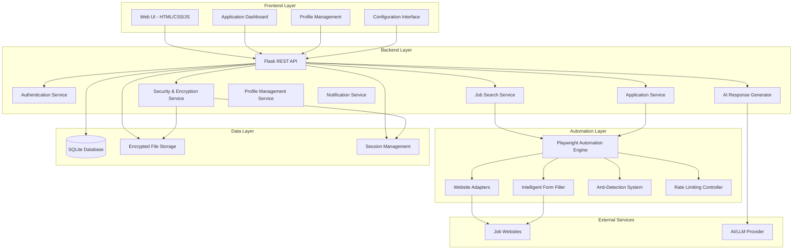

# Design Document

## Overview

The Job Application Agent is a comprehensive automation system that streamlines the job application process across multiple job platforms. The system integrates a Flask-based Python backend with SQLite database, a web-based frontend using vanilla HTML/CSS/JavaScript, and a Playwright-powered automation engine enhanced with AI capabilities for intelligent form filling and personalized response generation. The architecture prioritizes security, scalability, and adaptability to handle diverse job website structures while maintaining compliance with platform terms of service.

## Architecture

The system follows a modular, service-oriented architecture with clear separation of concerns:



## Components and Interfaces

### Frontend Components

#### 1. Profile Management Interface
- **Purpose**: User profile setup and configuration
- **Key Features**:
  - Personal information forms
  - Resume/cover letter upload and management
  - Job search preferences configuration
  - Multiple template management
- **Technology**: Vanilla HTML/CSS/JavaScript with modern ES6+ features

#### 2. Dashboard Interface
- **Purpose**: Application tracking and monitoring
- **Key Features**:
  - Real-time application status updates
  - Job search results display
  - Application history and analytics
  - Manual intervention alerts
- **Technology**: Dynamic JavaScript with WebSocket connections for real-time updates

#### 3. Configuration Interface
- **Purpose**: System and website-specific settings
- **Key Features**:
  - Website adapter configuration
  - Rate limiting settings
  - Security preferences
  - Automation scheduling

### Backend Services

#### 1. Flask REST API (`app.py`)
- **Endpoints**:
  - `/api/profile` - Profile CRUD operations
  - `/api/jobs` - Job search and management
  - `/api/applications` - Application tracking
  - `/api/automation` - Automation control
  - `/api/config` - System configuration
- **Middleware**: Authentication, rate limiting, error handling

#### 2. Job Search Service (`services/job_service.py`)
- **Responsibilities**:
  - Coordinate multi-site job searches
  - Duplicate detection and consolidation
  - Job filtering based on user preferences
  - Search result caching
- **Interface**:
```python
class JobSearchService:
    def search_jobs(self, criteria: SearchCriteria) -> List[Job]
    def filter_jobs(self, jobs: List[Job], preferences: UserPreferences) -> List[Job]
    def detect_duplicates(self, jobs: List[Job]) -> List[Job]
```

#### 3. Application Service (`services/application_service.py`)
- **Responsibilities**:
  - Manage application workflow
  - Track application status
  - Handle application retries and errors
- **Interface**:
```python
class ApplicationService:
    def submit_application(self, job: Job, user_profile: UserProfile) -> ApplicationResult
    def track_application(self, application_id: str) -> ApplicationStatus
    def retry_failed_application(self, application_id: str) -> ApplicationResult
```

#### 4. AI Response Generator (`services/ai_service.py`)
- **Responsibilities**:
  - Generate contextual responses to custom questions
  - Select appropriate resume/cover letter templates
  - Analyze job descriptions for keyword matching
- **Interface**:
```python
class AIService:
    def generate_response(self, question: str, job_context: JobContext, user_profile: UserProfile) -> str
    def select_best_template(self, job: Job, templates: List[Template]) -> Template
    def analyze_job_requirements(self, job_description: str) -> JobAnalysis
```

### Automation Engine

#### 1. Playwright Engine (`automation/playwright_engine.py`)
- **Responsibilities**:
  - Browser automation orchestration
  - Session management
  - Anti-detection measures
- **Features**:
  - Headless and headed browser modes
  - Multiple browser contexts for different sites
  - Human-like interaction patterns
  - Screenshot capture for debugging

#### 2. Website Adapters (`automation/adapters/`)
- **Structure**: One adapter per job website
- **Base Interface**:
```python
class WebsiteAdapter:
    def login(self, credentials: Credentials) -> bool
    def search_jobs(self, criteria: SearchCriteria) -> List[JobListing]
    def apply_to_job(self, job: JobListing, application_data: ApplicationData) -> ApplicationResult
    def get_selectors(self) -> SelectorConfig
```

#### 3. Intelligent Form Filler (`automation/form_filler.py`)
- **Capabilities**:
  - Dynamic form field detection
  - Intelligent field mapping
  - File upload handling
  - Custom question processing with AI integration

## Data Models

### Core Models

#### User Profile
```python
class UserProfile:
    id: str
    personal_info: PersonalInfo
    resumes: List[Resume]
    cover_letters: List[CoverLetter]
    preferences: JobPreferences
    credentials: Dict[str, EncryptedCredentials]
    created_at: datetime
    updated_at: datetime
```

#### Job
```python
class Job:
    id: str
    title: str
    company: str
    location: str
    description: str
    requirements: List[str]
    salary_range: Optional[SalaryRange]
    source_website: str
    source_url: str
    posted_date: datetime
    discovered_at: datetime
```

#### Application
```python
class Application:
    id: str
    job_id: str
    user_id: str
    status: ApplicationStatus
    submitted_at: Optional[datetime]
    materials_used: ApplicationMaterials
    custom_responses: Dict[str, str]
    confirmation_details: Optional[ConfirmationDetails]
    error_log: Optional[str]
```

### Database Schema

```sql
-- Users table
CREATE TABLE users (
    id TEXT PRIMARY KEY,
    email TEXT UNIQUE NOT NULL,
    encrypted_data TEXT NOT NULL,
    created_at TIMESTAMP DEFAULT CURRENT_TIMESTAMP
);

-- Jobs table
CREATE TABLE jobs (
    id TEXT PRIMARY KEY,
    title TEXT NOT NULL,
    company TEXT NOT NULL,
    location TEXT,
    description TEXT,
    source_website TEXT NOT NULL,
    source_url TEXT NOT NULL,
    posted_date TIMESTAMP,
    discovered_at TIMESTAMP DEFAULT CURRENT_TIMESTAMP,
    UNIQUE(source_url)
);

-- Applications table
CREATE TABLE applications (
    id TEXT PRIMARY KEY,
    job_id TEXT NOT NULL,
    user_id TEXT NOT NULL,
    status TEXT NOT NULL,
    submitted_at TIMESTAMP,
    materials_used TEXT,
    custom_responses TEXT,
    confirmation_details TEXT,
    error_log TEXT,
    created_at TIMESTAMP DEFAULT CURRENT_TIMESTAMP,
    FOREIGN KEY (job_id) REFERENCES jobs (id),
    FOREIGN KEY (user_id) REFERENCES users (id)
);
```

## Error Handling

### Error Categories

1. **Network Errors**: Connection timeouts, DNS failures
2. **Authentication Errors**: Invalid credentials, session expiration
3. **Parsing Errors**: Website structure changes, missing elements
4. **Rate Limiting**: Too many requests, temporary blocks
5. **Application Errors**: Form validation failures, submission errors

### Error Handling Strategy

```python
class ErrorHandler:
    def handle_error(self, error: Exception, context: ErrorContext) -> ErrorResponse:
        if isinstance(error, NetworkError):
            return self._handle_network_error(error, context)
        elif isinstance(error, AuthenticationError):
            return self._handle_auth_error(error, context)
        elif isinstance(error, RateLimitError):
            return self._handle_rate_limit_error(error, context)
        else:
            return self._handle_generic_error(error, context)
```

### Retry Logic
- Exponential backoff for network errors
- Immediate retry for transient failures
- Manual intervention required for authentication issues
- Automatic pause and resume for rate limiting

## Testing Strategy

### Unit Testing
- **Backend Services**: Mock external dependencies, test business logic
- **Automation Components**: Test selector logic, form filling algorithms
- **AI Integration**: Mock AI responses, test response formatting

### Integration Testing
- **API Endpoints**: Test full request/response cycles
- **Database Operations**: Test CRUD operations and data integrity
- **Playwright Integration**: Test browser automation workflows

### End-to-End Testing
- **Complete Application Flow**: Profile setup → Job search → Application submission
- **Multi-Website Testing**: Test across different job platforms
- **Error Scenario Testing**: Test error handling and recovery

### Testing Tools
- **Backend**: pytest, Flask-Testing
- **Frontend**: Jest for JavaScript testing
- **Automation**: Playwright's built-in testing capabilities
- **Database**: SQLite in-memory databases for testing

## Security Considerations

### Data Protection
- All sensitive data encrypted at rest using AES-256
- Credentials stored using industry-standard encryption
- Secure key management with environment variables

### Authentication & Authorization
- Session-based authentication for web interface
- API key authentication for automation processes
- Role-based access control for multi-user scenarios

### Anti-Detection Measures
- Random delays between actions
- Human-like mouse movements and typing patterns
- User-agent rotation and browser fingerprint management
- Respect for robots.txt and rate limiting

### Compliance
- GDPR compliance for data handling
- Terms of service compliance for job websites
- Ethical automation practices